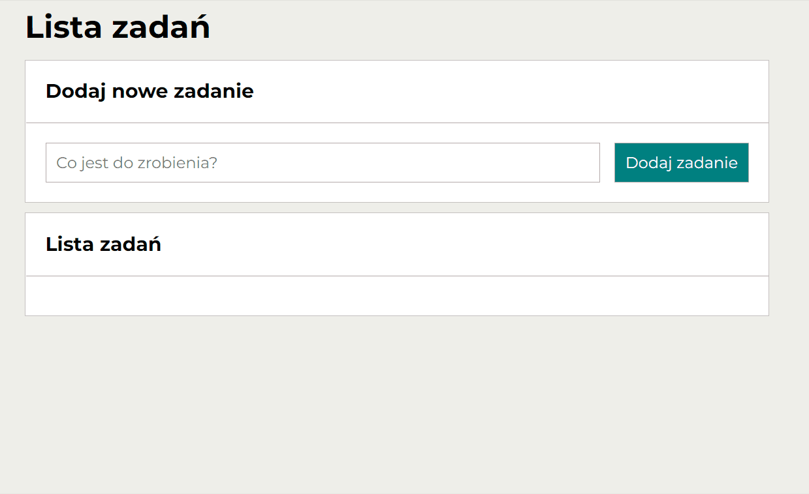

# To-do list

## Demo
[See my to-do list](https://justynaboesche.github.io/To-do-list/)
## Description
This is my next project created in the process of becoming the **Frontend Developer**. I have created a simple to-do list that allows you to add new tasks to the list below,
mark completed tasks and remove tasks from the list. You can also hide and show tasks that are marked as done and mark all tasks as done. The application has been prepared to be used in convenient way also on smaller devices.
## How it works
At the beginning you need to enter your first task. To add the task to the list below, you need to click the "Dodaj zadanie" button. You can add to the list as many tasks, as you want. If you want to mark one of the comleted tasks, you can click the green button. You can also remove a task from the list by clicking the red button. If you want to hide tasks that are marked as done, click the 'Ukryj ukończone' button, and if you want to show them once again, click the 'Pokaż ukończone' button. There is also possibility to mark all tasks as done by clicking the 'Ukończ wszystkie' button.
[Click here](https://justynaboesche.github.io/To-do-list/) and create your own to-do list!

## Technologies used in the project
To create the application I have used:
- HTML 5
- CSS Grid
- Normalize.css
- Media queries
- BEM convention
- JavaScript ES6+

